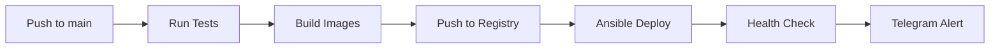

# Staging Deploy (Conveyor V3)

## Обзор

Автоматизированный pipeline для деплоя на staging сервер через GitHub Actions + Ansible.

**Процесс:**
1. CI прогоняет тесты (pytest)
2. Собирает Docker образы backend/frontend
3. Пушит в Docker Registry (tag = короткий git SHA)
4. Ansible на staging:
   - Копирует `docker-compose.staging.yml` и `.env`
   - `docker compose pull && up -d`
   - Health-check `/health`
5. (опционально) Телеграм уведомление

---

## Секреты в GitHub

### Обязательные

| Секрет | Описание | Пример |
|--------|----------|--------|
| `REGISTRY_URL` | Домен реестра | `registry.example.com` |
| `REGISTRY_NS` | Namespace | `watson` |
| `REGISTRY_USER` | Логин в реестр | `deploy-bot` |
| `REGISTRY_PASS` | Пароль/токен | `dckr_pat_xxx` |
| `SSH_KEY_B64` | Приватный SSH ключ (base64) | См. ниже |
| `STAGING_SSH_HOST` | IP/DNS staging | `staging.example.com` |
| `STAGING_SSH_USER` | SSH пользователь | `deploy` |

### Опциональные

| Секрет | Описание |
|--------|----------|
| `DEPLOY_PATH` | Путь на сервере (default: `/opt/apps/app`) |
| `TELEGRAM_TOKEN` | Токен бота для уведомлений |
| `TELEGRAM_CHAT_ID` | ID чата для уведомлений |

### Создание SSH_KEY_B64

```bash
# 1. Создайте SSH ключ (если нет)
ssh-keygen -t ed25519 -f ~/.ssh/deploy_key -N ""

# 2. Добавьте публичный ключ на staging сервер
ssh-copy-id -i ~/.ssh/deploy_key.pub deploy@staging.example.com

# 3. Закодируйте приватный ключ в base64
cat ~/.ssh/deploy_key | base64 -w 0

# 4. Скопируйте вывод и добавьте как SSH_KEY_B64 в GitHub Secrets
```

---

## Подготовка staging сервера

### 1. Установите Docker

```bash
# Ubuntu/Debian
curl -fsSL https://get.docker.com | sh
sudo usermod -aG docker $USER

# Перелогиньтесь для применения группы
```

### 2. Создайте структуру

```bash
sudo mkdir -p /opt/apps/myproject
sudo chown deploy:deploy /opt/apps/myproject
```

### 3. Создайте `.env.staging`

```bash
cat > /opt/apps/myproject/.env << 'EOF'
IMAGE_TAG=latest
REGISTRY_URL=registry.example.com
REGISTRY_NS=watson
BACKEND_PORT=8080
FRONTEND_PORT=5173
EOF
```

### 4. Настройте Docker login (если приватный registry)

```bash
docker login registry.example.com
```

---

## Как это работает

### CI/CD Flow



### GitHub Actions Workflow

```yaml
test → build → deploy
  ↓      ↓       ↓
pytest  docker  ansible
```

**Jobs:**
1. **test** - pytest + coverage
2. **build** - docker build + push (tag = git SHA)
3. **deploy** - ansible-playbook на staging

### Ansible Playbook

```yaml
tasks:
  - Ensure /opt/apps/<project>
  - Copy docker-compose.yml
  - Copy .env (если нет)
  - docker compose pull && up -d
  - curl /health (retry 10 раз)
```

---

## Запуск деплоя

### Автоматически (при push в main)

```bash
git add .
git commit -m "feat: add new feature"
git push origin main

# GitHub Actions автоматически задеплоит
```

### Вручную (workflow_dispatch)

1. Откройте **Actions** в GitHub
2. Выберите **CI-CD**
3. **Run workflow** → **main**

---

## Проверка деплоя

### Health Check

```bash
curl http://staging.example.com:8080/health
# {"ok": true}
```

### Metrics

```bash
curl http://staging.example.com:8080/metrics
```

**Проверьте:**
- `version.git_sha` - должен совпадать с последним коммитом
- `version.image_tag` - должен быть актуальный SHA
- `images.backend/frontend` - корректные пути
- `profile.active` - должно быть `staging`

### Логи

```bash
ssh deploy@staging.example.com
cd /opt/apps/myproject
docker compose logs -f --tail=200
```

---

## Роллбэк

### Вариант 1: Через .env

```bash
# На staging сервере
ssh deploy@staging.example.com
cd /opt/apps/myproject

# Найдите нужный SHA
git log --oneline -10

# Измените IMAGE_TAG
sed -i 's/IMAGE_TAG=.*/IMAGE_TAG=abc1234/' .env

# Перезапустите
docker compose pull
docker compose up -d
```

### Вариант 2: Git revert + redeploy

```bash
# Локально
git revert <bad-commit>
git push origin main

# Actions автоматически задеплоит откат
```

---

## Troubleshooting

### Build failed

**Проблема:** Docker build падает

**Решение:**
- Проверьте `Dockerfile` в backend/frontend
- Проверьте `requirements.txt` / `package.json`
- Запустите локально: `docker build .`

### Deploy failed: SSH connection refused

**Проблема:** Ansible не может подключиться

**Решение:**
```bash
# Проверьте SSH ключ
echo "$SSH_KEY_B64" | base64 -d | ssh-keygen -l -f -

# Проверьте подключение
ssh -i key deploy@staging.example.com

# Проверьте known_hosts
ssh-keyscan staging.example.com >> ~/.ssh/known_hosts
```

### Health check failed

**Проблема:** Backend не отвечает на `/health`

**Решение:**
```bash
ssh deploy@staging.example.com
cd /opt/apps/myproject

# Проверьте логи
docker compose logs backend

# Проверьте статус
docker compose ps

# Перезапустите
docker compose restart backend
```

### Images not found

**Проблема:** Registry не находит образы

**Решение:**
- Проверьте `REGISTRY_URL`, `REGISTRY_NS`
- Проверьте логины: `docker login <registry>`
- Проверьте теги в реестре
- Убедитесь что build job прошёл успешно

---

## Мониторинг

### GitHub Actions

- **Actions** → **CI-CD** - история деплоев
- Кликните на build - см. логи каждого шага

### Staging Server

```bash
# Uptime
uptime

# Disk space
df -h

# Docker stats
docker stats

# Logs
journalctl -u docker -f
```

### Telegram

Если настроены `TELEGRAM_TOKEN` и `TELEGRAM_CHAT_ID`:
- После каждого деплоя придёт сообщение: `*Deployed to staging* — abc1234`

---

## Best Practices

### 1. Тестирование перед деплоем

```bash
# Локально запустите CI
pwsh scripts\Run-CI.ps1

# Убедитесь что все тесты проходят
pytest -v

# Запустите E2E (если есть)
cd frontend && npm test
```

### 2. Версионирование образов

```bash
# Git SHA - лучший способ версионирования
# Легко откатиться на любой коммит
# Видно что именно задеплоено
```

### 3. Мониторинг метрик

```bash
# Проверяйте /metrics после деплоя
watch -n 5 'curl -s http://staging:8080/metrics | jq'
```

### 4. Backups

```bash
# Бэкапьте .env перед изменениями
cp .env .env.backup.$(date +%Y%m%d)

# Бэкапьте volumes (если есть БД)
docker compose exec postgres pg_dump -U user db > backup.sql
```

---

## Next Steps (V4)

- [ ] Blue-green deployments
- [ ] Canary releases
- [ ] Auto-rollback при провале health check
- [ ] Prometheus + Grafana мониторинг
- [ ] Alertmanager интеграция
- [ ] Multi-environment (staging → prod promotion)

---

**Версия:** Conveyor V3  
**Дата:** 2025-10-08  
**Статус:** ✅ Production Ready


